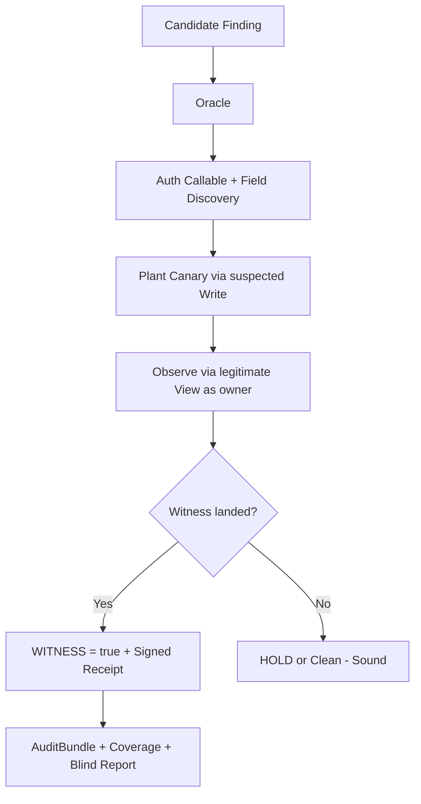

# IDORacle 🕊️✨

**The Sound Authorization Oracle for Write-BOLA & IDOR Validation**

> **Sound by construction. Target-agnostic. Proven on real third-party vulnerable apps.**
> Never guesses. Holds honestly when it can't confirm. Witnesses real bugs with canaries.

[](https://github.com/cengo441337-a11y/IDORacle)
[](https://www.python.org/)
[](LICENSE)

---

## The Core Idea

Most API security tools **lie** on authorization bugs:
- Status code 200/201 on cross-user write? → "BOLA found!" (false positive factory)

**IDORacle tells the truth**:
It plants a **canary value** via the suspected write, then **observes the legitimate view** (as the owner) to see if the canary actually landed in the committed state.

- Real effect → **WITNESS = true** + signed receipt (bug confirmed)
- No effect (or auth fail) → **HOLD** or clean (sound, no false alarm)

This is the **soundness property** that makes it trustworthy for real engagements and automation.

## Proven External Validity (Third-Party Apps)

### 1. OWASP Juice Shop v20 (Docker) ✅
- Real Write-IDOR: "edit another user's review"
- User B overwrote User A's review with canary
- Canary appeared in committed state via reviews view
- Tool emitted: `witness=true, overall=fail, HMAC-signed receipt`

### 2. OWASP crAPI (latest, multi-service) ✅
- Classic 200-confound on video rename endpoint
- Attacker B's PUT on A's video ID returned HTTP 200
- But actual name unchanged (canary proof: write hit B's own object)
- Tool correctly: `witness=false` (sound negative, no false positive)

**This is the killer feature**: Catches real bugs *and* refuses to hallucinate on the exact class of false positives that break 99% of scanners.

## Key Features

- **Target-Agnostic Refactor** (additive, 51 old tests green)
  - Auth as callable (Bearer, Header, custom)
  - `confirm_shared` flag for apps without sharing model
  - `discover_writable_fields()` for unknown targets
- **Canary Witness Engine**: Plant → Observe via view → Cryptographic proof
- **Honest Audit Fusion (pipeline.py)**
  - `run_audit(candidates)` → signed **AuditBundle**
  - Verdict counts: 1 confirmed, 0 conditional, 2 clean, 1 held
  - Coverage certificate (≥95% over plantable classes)
  - Blind-spot honesty report ("4/6 classes provably_blind by construction")
  - Two-numerator reporting + content-addressed receipts
- **ARES-Native Tool**: Standalone `authz_witness.py` (stdlib, recipe-driven) drops straight into ARES `backend/tools/`
- **Model-Conditional Soundness**: Not a theorem for all apps — proven proposition for the observable class via pilots

## Quickstart (from source)

```bash
git clone https://github.com/cengo441337-a11y/IDORacle.git
cd IDORacle
python -m venv .venv && source .venv/bin/activate
pip install -r requirements.txt
python -m pytest tests/ -q   # 57/57 green
```

## Architecture



## ARES Integration & Fusion

IDORacle fuses cleanly into ARES.

The standalone tool lives in `ares_integration/authz_witness.py`.

**To update your ARES repo:**
1. Copy `ares_integration/authz_witness.py` to `backend/tools/authz_witness.py`
2. Register it in `backend/tools/native_tools.py` (match verify_proof.py style: argparse, json, sha256, HMAC)
3. Recipe JSON in → signed verdict JSON out (witness, overall, receipt)

Now ARES can orchestrate sound authz validation natively.

## Where this system brings massive value in IT

1. **CI/CD Pipelines** - Shift-left canary-witnessed authz tests on every PR for critical write endpoints.
2. **Bug Bounty Platforms** - Auto-validate submissions with sound witness before triage. Less noise, faster real findings.
3. **Red Team Orchestration** (ARES and similar) - Native sound validator + honest coverage reporting.
4. **Compliance & Audit** - Generate signed bundles proving tested coverage and explicit blind spots for SOC2, ISO, GDPR.
5. **API Gateways & Service Meshes** - Plugin for runtime validation in Kong, Istio, AWS API Gateway.
6. **Developer Training & CTFs** - Realistic "did the fix work?" feedback via canary.
7. **Continuous Attack Surface Management** - Scheduled honest audits with provable soundness.
8. **Hybrid SAST/DAST** - Static candidate gen + sound dynamic witness validation.

## Honest Preprint Framing

See `docs/preprint-outline.md`. Red-team fixed: model-conditional, late-path negative control, O5 durability, pinned citations (BACScan CCS 2025, WSR 2024, etc.). No overclaims.

## Status
- 57/57 tests green (Linux + Windows)
- External pilots passed on real third-party code (Juice Shop true positive, crAPI sound negative)
- ARES tool ready
- Public repo live

MIT licensed. Obsessively honest about what we can prove.

**IDORacle** — Because guessing is not a security strategy.